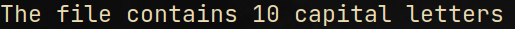
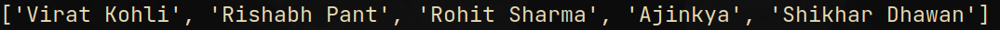

# Zestle Assignment

## 1. Count Capital Letters
write a one-liner that will count the number of capital letters in a file.
#### INPUT DATA:
FILE(s): 
> [letters.txt](letters.txt)

#### OUTPUT:
```python
python capital_letters.py
```


## 2. Convert dictionary containing key-value paired full names to a list of full names.
#### INPUT DATA:
> input = [
> {"FirstName": "Virat", "LastName": "Kohli"},
> {"FirstName": "Rishabh", "LastName": "Pant"},
> {"FirstName": "Rohit", "LastName": "Sharma"},
> {"FirstName": "Ajinkya", "LastName": None},
> {"FirstName": "Shikhar", "LastName": “Dhawan”}
> ]

#### OUTPUT:
```python
python full_names.py
```


## 3. Divide a csv in ‘n’ chunks and create ‘n’ new csv files.
#### INPUT DATA:
FILE(s):
> [sample.csv](sample.csv)

#### OUTPUT:
Refer [csv_data_chunking.ipynb](csv_data_chunking.ipynb) notebook for CSV data processing and [csv_output](csv_output) directory containing chunked CSV files.

## 4. Calculate difference between following dates.
#### INPUT DATA:
> (1) D1 : “2021-06-21”
>     D2 : “2021-02-19”
> (2) D1 : “2021-06-21 12:00:00”
>     D2 : “2021-02-19 21:30:00”
> (3) D1 : “May 21, 2021”
>     D2 : “Feb 29, 2022”

#### OUTPUT:
```python
python date_time_diff.py
```


## 5. Write a shell script or list commands to search a string in a text file and count the
number of lines in which the string has occurred.
#### INPUT DATA:
FILE(s): 
> [letters.txt](letters.txt)

#### OUTPUT:
```sh
./count_string.sh
```

